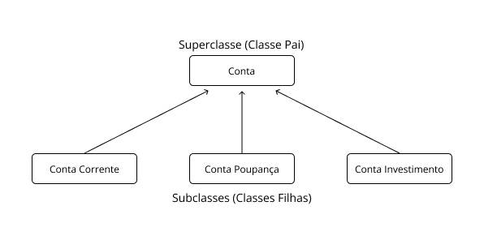

# 1. Princípios da Orientação a Objetos

O alicerce da Programação Orientada a Objetos é baseado em quatro princípios, os quais devem ser pensados e refletidos nos processos do desenvolvimento de um sistema: Abstração, Encapsulamento, Herança e Modularização.

## 1.1. Abstração

Entendimento e análise das necessidades do sistema, abstraindo do mundo real.

**Ex.:** para um sistema de gerenciamento acadêmico de uma faculdade, mais especificamente para a funcionalidade de cadastro de alunos, os moldes (classes) devem ser pensados com base nas características reais de um aluno (registro, nome, endereço, curso, data de nascimento etc.) e que sejam relevantes para o sistema. Por exemplo: informações como altura e peso podem ser irrelevantes para o sistema.

## 1.2. Encapsulamento

Encapsulamento é o princípio de isolar partes do software, organizando-o de maneira que seus componentes sejam independentes. O objetivo é tornar o software mais flexível, facilitando sua modificação e evolução. As classes devem proteger suas informações e comportamentos, garantindo controle sobre o acesso aos seus atributos e métodos. De forma análoga ao mundo real, os objetos também possuem mecanismos de proteção.

**Ex.:** quando um cliente compra um micro-ondas e deseja utilizá-lo, basta acionar os botões para programar um tempo (inserindo informações aos seus atributos) e pressionar o botão para iniciar o aquecimento (invocando um comportamento). Esses botões irão acionar os circuitos elétricos e as placas internas, sem que o cliente tenha a necessidade de conhecimento do que ocorre dentro da “CÁPSULA” do micro-ondas.

Da mesma forma, as classes devem esconder sua implementação interna, permitindo que outras classes interajam apenas com suas funcionalidades, sem a necessidade de conhecer os detalhes de sua lógica interna. Isso garante que a interação ocorra apenas através das interfaces disponibilizadas, similar aos botões do micro-ondas.

## 1.3. Herança

Na programação orientada a objetos, a herança é um conceito que reflete relações existentes no mundo real. Por exemplo, um filho pode herdar a cor dos olhos de seu pai, que, por sua vez, herdou essa característica de seu avô.

No contexto da programação, a herança é o mecanismo pelo qual uma classe (subclasse) pode estender outra classe (superclasse), recebendo seus comportamentos (métodos) e variáveis (atributos). Por exemplo, a classe "Mamífero" pode ser considerada a superclasse da classe "Humano"; assim, um humano é um mamífero e herda os atributos e métodos da classe "Mamífero".

A herança é um dos mecanismos fundamentais nas linguagens que suportam o paradigma da orientação a objetos. Esse recurso permite a criação de novas classes a partir de classes já existentes, facilitando a reutilização de atributos e métodos. Dessa forma, é possível derivar uma nova classe mais especializada a partir de uma classe genérica.

A aplicação da herança envolve basicamente dois elementos: a superclasse (classe pai) e a subclasse (classe filha). A Figura 1.1 a seguir ilustra essa relação de herança.

    
    
Figura 1.1: Herança entre classes.

## 1.4. Modularização

A modularização é o processo de dividir um sistema em partes bem definidas, que podem ser construídas e examinadas separadamente, permitindo que interajam entre si. Assim como no mundo real, a programação orientada a objetos possibilita a criação de comportamentos modulares, que podem ser reutilizados em diversos sistemas distintos.

Por exemplo, a classe "Aluno", se desenvolvida com base nos princípios da modularização, pode ser utilizada em diferentes contextos, como em um sistema de cadastro de alunos, em um sistema financeiro da instituição, para lançamento de notas ou consulta ao boletim, entre outros.
