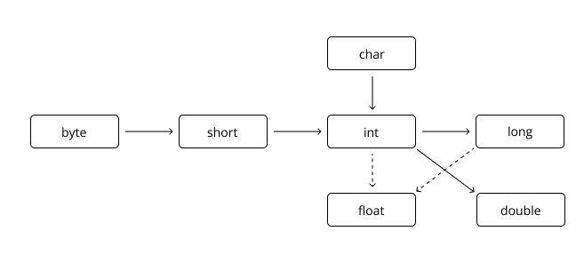

# 2. Variáveis

No Java, as informações são armazenadas por meio de variáveis, cada uma com um nome e um tipo que define o dado que será armazenado. A declaração de uma variável segue o padrão de especificar o tipo, seguido pelo nome, como nos exemplos abaixo:

```
int idade;
doube preco;
```

Também é possível declarar várias variáveis do mesmo tipo em uma única linha, separando-as por vírgulas:

```
double preco, salario;
```

Como Java é uma linguagem fortemente tipada, cada variável precisa ter seu tipo explicitamente declarado. Existem oito tipos primitivos para o armazenamento de informações. Esses tipos primitivos não são objetos, mas elementos internos da linguagem, o que os torna mais eficientes. Além disso, variáveis podem armazenar objetos.

Os nomes de variáveis podem começar com uma letra, um sublinhado (_), ou o símbolo $. Após o primeiro caractere, é possível usar qualquer combinação de letras e números. Por convenção, os nomes das variáveis devem começar com uma letra minúscula, e se o nome for composto por mais de uma palavra, a primeira letra das palavras subsequentes deve ser maiúscula.

Vale lembrar que o Java é case-sensitive, ou seja, diferencia letras maiúsculas de minúsculas. Assim, variáveis como `preco` e `Preco` são distintas.

Java oferece oito tipos primitivos, sendo quatro dedicados ao armazenamento de números inteiros, positivos ou negativos, sem parte fracionária. A tabela a seguir descreve esses tipos, o espaço que ocupam na memória e o intervalo de valores que podem armazenar:

| Tipo  | Armazenamento | Intervalo                                              |
| ----- | ------------- | ------------------------------------------------------ |
| int   | 4 bytes       | -2.147.483.648 a 2.147.483.647                         |
| short | 2 bytes       | -32.768 a 32.767                                       |
| long  | 8 bytes       | -9.223.372.036.854.775.808 a 9.223.372.036.854.775.807 |
| byte  | 1 byte        | -128 a 127                                             |

A principal diferença entre esses tipos está no tamanho do número que podem armazenar e na quantidade de memória necessária. O tipo `int` é o mais utilizado na maioria das situações, mas para armazenar números maiores, o tipo `long` deve ser escolhido.

Para números de ponto flutuante, que contêm parte fracionária (números decimais), há dois tipos disponíveis, conforme a tabela abaixo:

| Tipo   | Armazenamento | Intervalo                          |
| ------ | ------------- | ---------------------------------- |
| float  | 4 bytes       | 7 dígitos decimais significativos  |
| double | 8 bytes       | 15 dígitos decimais significativos |

O tipo `double` oferece maior precisão em comparação ao `float`, sendo o mais utilizado em situações que requerem maior exatidão.

Além desses, o tipo `char` é utilizado para armazenar caracteres individuais, como letras, números ou sinais de pontuação. Já o tipo `boolean` armazena valores lógicos, podendo ser true (verdadeiro) ou false (falso). No Java, não é possível converter números inteiros em valores booleanos.

## 2.1. Atribuindo Valores às Variáveis

Após declarar uma variável, é possível atribuir um valor a ela utilizando o operador de atribuição, representado pelo sinal de igual `=`. Por exemplo:

```
int idade = 10;
double preco = 25.0;
char sexo = 'M';
boolean maiorIdade = false;
```

Em algumas situações, pode ser necessário converter um tipo de dado para outro. A Figura 2.1 abaixo apresenta as conversões possíveis entre os tipos de dados.

<div align="center">
    
    <p>Figura 2.1: Conversões de tipos.</p>
</div>

As setas sólidas indicam conversões onde não há perda de informação, pois a mudança ocorre de um tipo menor para um maior. Já as setas pontilhadas indicam conversões que podem resultar em perda de informações. Por exemplo, um número inteiro grande pode exceder a capacidade de armazenamento de um `float`.

O código a seguir demonstra algumas conversões que podem ser realizadas automaticamente, chamadas de conversões implícitas:

```
public class Conversoes {
    public static void main(String[] args) {
        int x = 10;
        double d = x; // Conversão implícita
        long l = x; // Conversão implícita
        float f = x; // Conversão implícita
    }
}
```

No entanto, em certos casos, não é possível realizar conversões automáticas. Por exemplo, converter um valor do tipo `double` para `int` não ocorre de forma automática, pois há risco de perda de informações. Para realizar esse tipo de conversão, chamada de "casting", é necessário indicar explicitamente o tipo de destino entre parênteses:

```
double x = 10.0;
int y = (int) x;
```

No exemplo acima, o valor de `x`, do tipo `double`, é convertido para `int`, e a variável `y` recebe apenas a parte inteira do número, resultando na perda da parte fracionária.