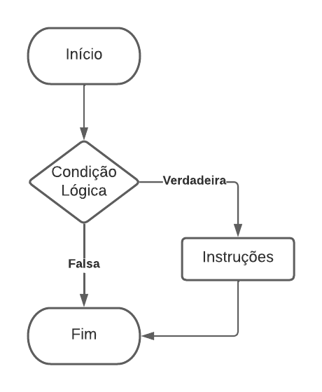
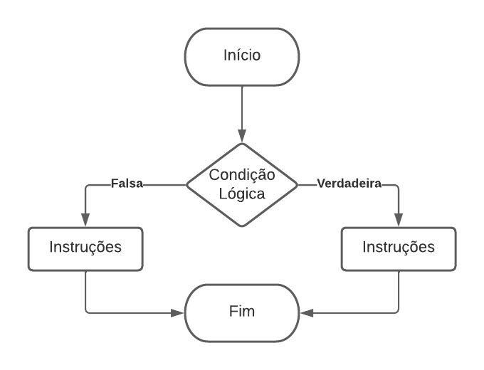

# 4. Fluxo de Controle (Condicionais)

As estruturas condicionais permitem que um programa execute diferentes blocos de código dependendo de uma condição. No Java, a instrução condicional é feita com a palavra-chave `if`, com a seguinte sintaxe:

```
if (condição) {
    // instruções a serem executadas se a condição for verdadeira
}
```

As chaves `{}` delimitam o bloco de código pertencente ao `if`. A condição é escrita entre parênteses e pode incluir expressões combinadas com operadores lógicos. Se a condição for verdadeira, o bloco de código dentro do `if` será executado. A figura 4.1 Abaixo mostra o comportamento básico de um `if`.

<div align="center">
    
    <p>Figura 4.1: Fluxograma (comando if).</p>
</div>

Também é possível adicionar o comando `else` (opcional), para tratar o caso em que a condição do `if` seja falsa:

```
if (condição) {
    // instruções se a condição for verdadeira
} else {
    // instruções se a condição for falsa
}
```

Quando a condição no `if` é falsa, o bloco de código do `else` será executado. Isso permite que o programa tenha um fluxo alternativo de execução, conforme ilustrado no fluxograma de um comando `if-else`.

<div align="center">
    
    <p>Figura 4.2: Fluxograma (comando if-else).</p>
</div>

Pode-se combinar vários `if` e `else` para criar condições mais complexas. Por exemplo:

```
if (x > 10) {
    System.out.println("X é maior que 10");
} else if (x == 10) {
    System.out.println("X é igual a 10");
} else {
    System.out.println("X é menor que 10");
}
```

Nesse exemplo, primeiro é verificado se `x` é maior que 10. Se não for, a segunda condição verifica se `x` é igual a 10. Caso nenhuma das condições anteriores seja verdadeira, o bloco do `else` será executado, imprimindo que "X é menor que 10".

**Observação:** Um else sempre se refere ao if mais próximo que ainda não tenha um else correspondente.