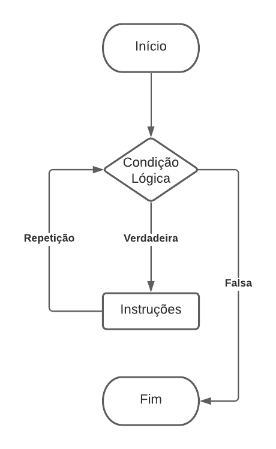
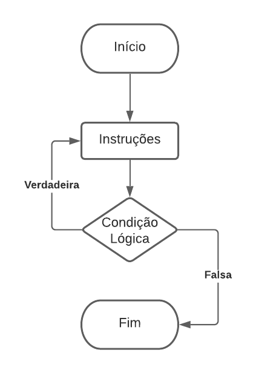

# 6. Fluxo de Repetição

Fluxos de repetição, ou loops, permitem que um bloco de código seja executado repetidamente enquanto uma condição for verdadeira. No Java, existem três estruturas de repetição: `while`, `do-while` e `for`.

## 6.1. While

O loop `while` cria um laço que executa uma instrução (ou um conjunto de instruções) enquanto a condição de teste for avaliada como verdadeira. A estrutura básica é:

```
while (condição) {
     instrução;
}
```

Se a condição for verdadeira, a instrução é executada. Quando a condição for falsa, o loop é interrompido, e o fluxo do programa segue a próxima instrução. Vale ressaltar que o loop `while` não será executado se a condição inicial for falsa. A figura 6.1 a seguir mostra o fluxograma do laço `while`.

<div align="center">
    
    <p>Figura 6.1: Fluxograma (while).</p>
</div>

Por exemplo, o código a seguir imprime os números de 1 a 10:

```
public class While {
    public static void main(String[] args) {
        int numero = 0;
        while (numero < 10) {
            numero++;
            System.out.println(numero);
        }
    }
}
```

Nesse código, a variável `numero` é iniciada com o valor 0. A cada iteração, ela é incrementada em uma unidade e seu valor é exibido no console. Quando `numero` atinge 10, a condição do `while` se torna falsa e o loop é encerrado.

O teste da condição ocorre antes de cada iteração, o que significa que o loop pode não ser executado nenhuma vez se a condição for falsa desde o início. Para garantir que o bloco de código seja executado ao menos uma vez, o teste pode ser movido para o final do loop, utilizando a estrutura `do-while`.

## 6.2. Do-While

No loop `do-while`, o bloco de código é executado primeiro, e a condição é testada posteriormente para verificar se o bloco será repetido. A sintaxe básica desse loop é:

```
do {
     instrução;
} while (condição);
```

A principal diferença entre os loops `while` e `do-while` é a posição do teste: no `do-while`, o teste ocorre no final, garantindo que o código seja executado pelo menos uma vez, independentemente da condição. Esse comportamento é útil quando não se sabe previamente quantas vezes o loop será executado, pois depende de interações ou valores inseridos pelo usuário. A figura 6.2 a seguir mostra o fluxograma do laço `do-while`.

<div align="center">
    
    <p>Figura 6.2: Fluxograma (do-while).</p>
</div>

No exemplo abaixo, o código realiza a soma de dois números digitados e verifica se o usuário deseja realizar outra operação:

```
import java.util.Scanner;

public class DoWhile {
    public static void main(String[] args) {
        Scanner sc = new Scanner(System.in);
        String opcao;
        do {
           System.out.print("Digite um número: ");
           int n1 = sc.nextInt();
           System.out.print("Digite outro número: ");
           int n2 = sc.nextInt();
           int soma = n1 + n2;
           System.out.println("A soma é: " + soma);
           System.out.print("Deseja realizar outra operação? S/N: ");
           opcao = sc.next();
        } while (opcao.equals("S"));
        System.out.println("Fim do programa");
        sc.close();
    }
}
```

Nesse exemplo, o programa realiza a leitura de dois números e calcula sua soma. Após a operação, é verificado se o usuário deseja continuar, com base na resposta fornecida. Caso a resposta seja "S", o loop é repetido, solicitando novos números. É importante destacar que, para comparar strings, o método `equals()` deve ser utilizado no lugar do operador `==`, garantindo uma comparação correta.