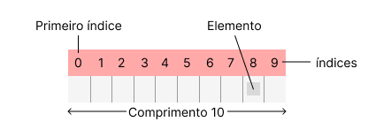

# 7. Arrays

Um array é uma estrutura de dados que armazena uma coleção de elementos do mesmo tipo, que pode ser um tipo primitivo ou um objeto. Cada elemento dentro do array possui um índice numérico, utilizado para acessar e manipular os dados. O índice começa em 0, ou seja, o primeiro elemento do array é acessado com o índice 0, o segundo com o índice 1, e assim por diante. O comprimento do array é fixo, ou seja, uma vez definido, não pode ser alterado. O atributo `length` permite recuperar o tamanho do array, como ilustrado na Figura 7.1, que mostra um array com 10 posições e seus índices correspondentes.

    
    
Figura 7.1: Array com 10 posições.

