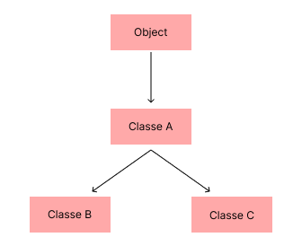

# 13. Herança

Uma classe que herda de outra é denominada subclasse, enquanto a classe de onde se herda é chamada de superclasse. A herança permite a reutilização de atributos e métodos de classes já definidas, possibilitando a criação de novas classes mais especializadas a partir de classes genéricas existentes.

Uma classe pode ter apenas uma superclasse, ou seja, a herança múltipla não é permitida. No entanto, uma classe pode ter um número ilimitado de subclasses. Dessa maneira, uma subclasse herda todas as características da superclasse, bem como de todas as classes acima dela na hierarquia.

A hierarquia de classes tem início na classe `Object`, a qual é a superclasse de todas as classes, seja de forma direta ou indireta, conforme ilustrado na Figura 13.1 a seguir:

<div align="center">
    
    <p>Figura 13.1: Hierarquia de classes.</p>
</div>

Conforme ilustrado na figura acima, a classe `Object` é a superclasse da classe `A`, que, por sua vez, serve como superclasse das classes `B` e `C`. Dessa forma, as classes `B` e `C` herdam todos os atributos e métodos da classe `A`, e, por conseguinte, da classe `Object`.

A palavra-chave `extends` é utilizada na declaração de uma classe para indicar sua superclasse. Se a classe não incluir essa palavra-chave em sua declaração, a herança será feita diretamente da classe `Object`. A sintaxe para declarar uma subclasse é a seguinte:

```
[public] class <subclasse> extends <superclasse> {
}
```

Dessa forma, a estrutura de herança em Java facilita a organização e reutilização de código, promovendo a especialização e a extensibilidade das classes.

## 13.1. Prática

Modifique a classe `Conta` para que ela tenha as subclasses `ContaCorrente` e `ContaPoupanca`. A classe `Conta` herda diretamente da classe `Object`.

```
public class Conta {
    private int numero, agencia;
    private double saldo;

    public Conta() { }

    public Conta(int numero, int agencia, double saldo) {
        this.numero = numero;
        this.agencia = agencia;
        this.saldo = saldo;
    }

    public void setNumero(int numero) {
        this.numero = numero;
    }

    public int getNumero() {
        return numero;
    }

    public void setAgencia(int agencia) {
        this.agencia = agencia;
    }

    public int getAgencia() {
        return agencia;
    }

    public void setSaldo(double saldo) {
        this.saldo = saldo;
    }

    public double getSaldo() {
        return saldo;
    }

    public void depositar(double valor) {
        saldo += valor;
    }

    public void retirar(double valor) {
        saldo -= valor;
    }

    public double verificarSaldo() {
        return getSaldo();
    }
}
```

A classe `ContaCorrente` possui dois atributos adicionais: o tipo de conta, que pode ser "básica", "especial" ou "premium", e o valor do cheque especial, que representa o limite de crédito adicional disponível ao cliente. Já a classe `ContaPoupanca` não apresenta essas distinções. Abaixo está a implementação inicial da classe `ContaCorrente`, que herda da classe `Conta`:

```
public class ContaCorrente extends Conta {
    private String tipo;
    private double chequeEspecial;

    public void setTipo(String tipo) {
        this.tipo = tipo;
    }

    public String getTipo() {
        return tipo;
    }

    public void setChequeEspecial(double chequeEspecial) {
        this.chequeEspecial = chequeEspecial;
    }

    public double getChequeEspecial() {
        return chequeEspecial;
    }

    public double saldoDisponivel() {
        return getSaldo() + chequeEspecial;
    }
}
```

O encapsulamento é utilizado para proteger tanto o atributo `tipo`, que especifica a categoria da conta corrente, quanto o atributo `chequeEspecial`, que representa o limite adicional de crédito disponível. O método `saldoDisponivel` retorna a soma do saldo da conta com o valor do cheque especial, indicando o total de recursos acessíveis ao titular da conta.

As variáveis que armazenam referências a objetos são polimórficas, o que significa que uma variável de uma superclasse pode referenciar qualquer objeto de suas subclasses. Por exemplo:

```
Conta conta = new Conta();
Conta cc = new ContaCorrente();
```

Para atribuir o objeto referenciado por `cc` a uma variável do tipo `ContaCorrente`, é necessário realizar um cast explícito:

```
ContaCorrente c1 = (ContaCorrente) cc;
```

O cast força um objeto a ser tratado como outro tipo. Neste caso, o objeto `cc` é forçado a ser do tipo `ContaCorrente`. Se o objeto não for compatível com o tipo ao qual está sendo forçado, será lançada a exceção `ClassCastException`:

```
ContaCorrente c2 = (ContaCorrente) conta; // Lançará ClassCastException
```

Para evitar essa exceção, é possível verificar o tipo do objeto usando a instrução `instanceof`, que retorna `true` se o objeto à esquerda for do tipo especificado à direita:

```
public class Teste {
    public static void main(String[] args) {
        Conta cc = new Conta();

        if (cc instanceof Conta) {
            System.out.println("cc é do tipo Conta!");
        } else {
            System.out.println("cc não é do tipo Conta!");
        }
    }
}
```